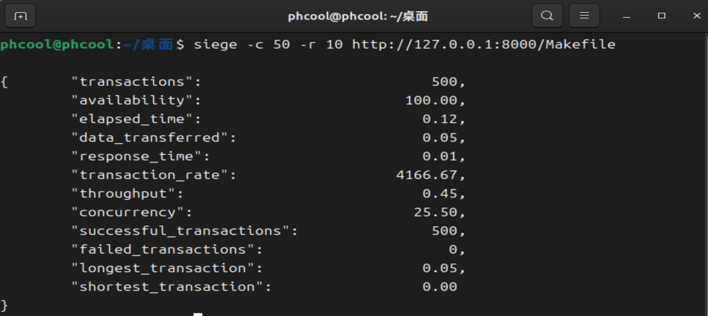

# 实验报告
## 一.编译和运行方法说明
在src目录中有server.c和Makefile，在终端中用make命令可以在目录下得到server的可执行文件，再用命令./server即可运行。
## 二.整体设计
#### 1.实现了必做部分的内容，对示例代码未完成的部分做了补充
整体的流程为，通过accept得到描述符，然后循环读取缓冲区得到请求头，对请求头进行解析得到访问路径，再根据访问路径打开对应的文件，对各种错误进行处理，然后将文件的内容放入返回头中，将返回头中的内容循环写入缓冲区，至此结束了一次请求的相应。
#### 2.使用了线程池技术
在接收请求之前，先初始化一个任务队列，用*thread_pool_worker函数初始化一定数量的线程，使得这些线程能够处理队列中的任务，每次accept一个请求，将任务入队列，然后线程处理任务的时候，出队列获取任务，如果队列满或者空，利用条件变量使得线程等待队列更新，并且利用互斥锁，使得每次各个线程更新队列中的数据的操作都是原子的。
## 三.siege测试结果
在虚拟机中访问Makefile文件，用siege测试得到的结果如下：
